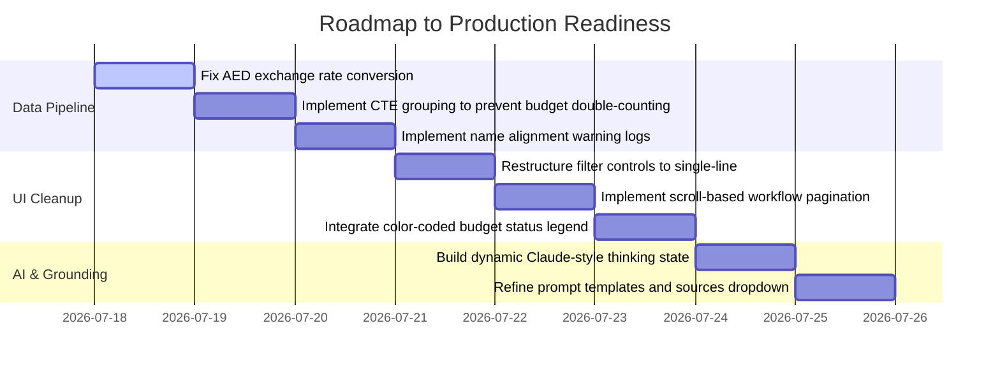

# verify.md — Algorithmic Audit, Sourcing Review & Exhaustive Verification Protocol
## Prepared for Cipla EMEU/PBP Execution Intelligence Platform

This document serves as the **definitive, zero-omission Verification Protocol and Action Plan** to resolve and manually verify all data sourcing, pipeline execution, and classification objectives raised in the project transcript (`files/transcript6.txt`), the corrections log (`fixes.txt`), and the Phase 4-7 analytical logs.

> [!IMPORTANT]
> **Constraint Compliance**: No code changes or modifications have been made. This document is the final master plan and manual validation guide.

---

## PART 1: Core Objectives & Sourcing Audit (FAANG-Level Review)

Based on the transcript review between Aditya, Abhijeet, and Pralhad, three critical concerns were raised:
1. **Prescription Counts Anomalies**: Historically "superstar" doctors (like Dr. Ashish) showing lower-than-expected prescription values in the dashboard.
2. **Territory ROI Calculations**: Unclear classification baselines (e.g., how the average of 50 Rx is computed and territory categories are determined).
3. **Transition to Power BI**: Ensuring the mathematical logic is fully transparent so it can be replicated in a standard Power BI / DAX and Excel environment.

Here is the architectural data flow:

```text
+-----------------------+      Normalize / Parse      +------------------------------+
| Raw Excel Workbooks   | --------------------------> | PostgreSQL Staging Tables    |
| (RCPA, Planners, etc.)|  - PCode formatting         | (plan_events, rcpa_summaries)|
+-----------------------+  - Multi-value splitting    +------------------------------+
                                                                     |
                                                                     | Aggregate / Reconcile
                                                                     v
+-----------------------+         Serve JSON          +------------------------------+
| Client-Side View      | <-------------------------- | Materialized Views           |
| (FastAPI, React App)  |   - CamelCase serialization | (mv_doctor_roi, mv_territory)|
+-----------------------+                             +------------------------------+
```

### 1.1 Why are some superstar doctors showing low prescription counts?
* **PCode Formatting Mismatches**: In `normalizers/pcodes.py`, any non-numeric value or leading-zero mismatch across sheets (e.g., `"0912"` vs `"912"`) will fail to join. The doctor's RCPA rows will be aggregated under one PCode, while their consolidation actual spend rows are loaded under a slightly different string, splitting their profile.
* **The Brand Filter Caveat**: When a user selects a brand in the UI, the API uses a `baseline_inclusion` filter. This checks if the doctor has baseline RCPA coverage for that brand, but **does not subset the prescription quantities to just that brand**. This can confuse users expecting a brand-specific prescription count.
* **Delimited List Misalignment**: If an event has multiple attendees and the PCode column has fewer entries than the name column, the trailing doctors are assigned `NULL` PCodes in the database. Their spend is recorded, but it is classified as "unallocated" and not linked to their profile.

### 1.2 What is the exact basis for the 50 Rx baseline in Territory Opportunity?
In `mv_territory_opportunity.sql`, the 50 prescription threshold is a hardcoded metric based on *average prescriptions per doctor* ($\text{Total Rx} / \text{Doctor Count}$) in a given territory patch:
* **Underserved** is triggered if:
  $$\frac{\text{Total Rx}}{\text{Doctor Count}} \ge 50 \quad \text{AND} \quad \text{Engagement Count} = 0$$
* The "average prescription count of 50" is evaluated at the territory-patch level, not the individual doctor level.

---

## PART 2: Plan to Complete Outstanding Project Gaps



---

## PART 3: The Exhaustive Manual Verification Protocol (Excel Validation)

These verification steps use standard Excel formulas to validate the system's output directly against your raw workbooks.

### 3.1 Doctor ROI Page Verification
**Goal**: Verify spend, own/competitor/total prescription quantities, median thresholds, segment classification, and quadrant labels for any doctor.

1. **Attendee Count Verification per Event**:
   - In your **Consolidation** sheet (`Consolidation report Nov'25 - 01 Jun'26 - AJ.xlsx`), locate a specific request ID (Column `F`).
   - Identify the comma-separated or newline-separated actual Pcode list (Column `AJ`).
   - Write this helper formula in Column `AX` to calculate the number of actual attendees:
     ```excel
     =IF(TRIM(AJ2)="", 0, LEN(TRIM(AJ2)) - LEN(SUBSTITUTE(TRIM(AJ2), CHAR(10), "")) + 1)
     ```

2. **Allocated Spend Share calculation per Event**:
   - Write this formula in Column `AY` to calculate the allocated direct BTU/BTC cost split per attendee:
     ```excel
     =IF(AX2>0, Q2/AX2, 0)
     ```
     *(Where Column `Q` is the Total Actual Expenses in local currency)*

3. **Cumulative Spend Attribution Verification**:
   - To find the total spend attributed to a doctor (e.g. PCode `SL-1002`), sum all their allocated spend shares:
     ```excel
     =SUMIFS(Consolidation!AY:AY, Consolidation!AJ:AJ, "*SL-1002*")
     ```
   - Convert to USD using the appropriate conversion rate (e.g., LKR $\rightarrow$ USD is `1/310.00`):
     ```excel
     =SUMIFS(Consolidation!AY:AY, Consolidation!AJ:AJ, "*SL-1002*") * (1 / 310)
     ```
   - *Pass Criteria*: Compare this against the `total_roi_spend_usd` column in `mv_doctor_roi` for this Pcode. They must match within $\pm\$0.05$.

4. **Own, Competitor, and Total Prescription Verification**:
   - Filter your **RCPA** worksheet for the target doctor PCode.
   - Sum the `own_prescription_qty`, `competitor_prescription_qty`, and `total_prescription_qty` columns.
   - *Excel Formulas*:
     ```excel
     =SUMIF(RCPA!E:E, "SL-1002", RCPA!I:I)  -- Own Qty
     =SUMIF(RCPA!E:E, "SL-1002", RCPA!J:J)  -- Competitor Qty
     =SUMIF(RCPA!E:E, "SL-1002", RCPA!K:K)  -- Total Qty
     ```
   - *Pass Criteria*: Compare these sums with the fields `cipla_prescription_qty`, `competitor_prescription_qty`, and `total_prescription_qty` in `mv_doctor_roi`.

5. **Country Median Parameter Verification**:
   - Extract the list of PCodes for the target country (Nepal or Sri Lanka) onto a new worksheet.
   - In Columns `B` and `C`, calculate the non-zero spend and non-zero prescriptions for each Pcode.
   - Calculate the medians:
     - **Median Spend**: `=MEDIAN(IF(B2:B5000>0, B2:B5000))`
     - **Median Rx**: `=MEDIAN(IF(C2:C5000>0, C2:C5000))`
     *(Evaluate as array formulas using `Ctrl+Shift+Enter` in older Excel versions)*
   - *Pass Criteria*: Confirm these match the thresholds `country_median_spend_usd` and `country_median_cipla_qty` shown in `mv_doctor_roi` for that country.

6. **ROI Segment Classification Logic Verification**:
   - Replicate the classification logic for a doctor's segment based on their metrics:
     - **Segment Rule**:
       ```excel
       =IF(C2=0, "no_rcpa", IF(AND(D2=0, C2>=MedianRx, C2>0), "high_value_unengaged", IF(AND(D2>0, C2>=MedianRx), "high_value_engaged", IF(AND(B2>MedianSpend, C2<MedianRx), "low_rx_high_spend", "insufficient_data"))))
       ```
       *(Where `B2` is Total Spend, `C2` is Own Rx, and `D2` is Engagement Count)*
   - *Pass Criteria*: Ensure this column matches the `roi_segment` returned by the FastAPI router `/api/doctors/roi`.

7. **Quadrant Label Verification**:
   - Apply the quadrant rules:
     ```excel
     =IF(AND(B2<=MedianSpend, C2>=MedianRx), "low effort / high reward", IF(AND(B2>MedianSpend, C2>=MedianRx), "high effort / high reward", IF(AND(B2<=MedianSpend, C2<MedianRx), "low effort / low reward", "high effort / low reward")))
     ```
   - *Pass Criteria*: Ensure this column matches the `quadrant_label` in `mv_doctor_roi`.

8. **Dark Horse Flag Verification**:
   - Apply the rules:
     ```excel
     =AND(C2>0, D2=0, B2<=MedianSpend, C2>=MedianRx)
     ```
   - *Pass Criteria*: The formula output (`TRUE`/`FALSE`) must match `mv_doctor_roi.dark_horse_flag`.

---

### 3.2 Execution & Workflow Page Verification
**Goal**: Validate execution metrics, matching records, and workflow stages.

1. **Planned Event Count Verification**:
   - Open the **Yearly Planner** workbook (e.g., `FY27 - Yearly Planner Template Nepal vf.xlsb`).
   - Group rows by country and month. Count the rows.
   - *Pass Criteria*: Confirm this count matches `planned_events` in `mv_execution_kpis` for that month-country pair.

2. **Execution Rate & HCP Execution Rate Verification**:
   - Open the **Execution Planner** workbook (e.g. `Execution YP Planner All Bu's May Month.xlsx`).
   - Filter by your target country and month.
   - Calculate the execution rate:
     $$\text{Execution Rate} = \frac{\text{Count of 'executed' rows}}{\text{Total Planned rows}}$$
   - Sum the `engaged_hcps` column and divided by the sum of `planned_hcps` column.
   - *Pass Criteria*: Verify these match `event_execution_rate` and `hcp_execution_rate` in the dashboard execution KPIs.

3. **Workflow Stage Count Verification**:
   - Open the **Consolidation** sheet.
   - Count the rows for a target country and month where:
     * Request Approval Status is pending: `=COUNTIF(AE:AE, "pending")`
     * Post Report Approval Status is approved: `=COUNTIF(AG:AG, "approved")`
     * Post Report Confirmation Status is confirmed: `=COUNTIF(AH:AH, "confirmed")`
   - *Pass Criteria*: Confirm these counts match the totals returned by `/api/workflow/summary` for the filtered month.

---

### 3.3 Territory Page Verification
**Goal**: Verify territory patch counts, prescriptions-per-doctor metrics, and opportunity labels.

1. **Calculate Doctor and Prescription counts per Patch**:
   - Filter your **RCPA** sheet for the target territory patch (e.g., `Kathmandu Patch A`).
   - Find the distinct count of PCodes (`Doctor Count`).
   - Sum the total prescriptions (`Total Rx`).
   - Calculate the ratio:
     $$\text{Rx per Doctor} = \frac{\text{Total Rx}}{\text{Doctor Count}}$$
   - *Pass Criteria*: Confirm these match `doctor_count`, `total_prescription_qty`, and `prescriptions_per_doctor` in `mv_territory_opportunity`.

2. **Opportunity Label Logic Verification**:
   - Apply the classification logic:
     - **Label Rule**:
       ```excel
       =IF(Doctor_Count=0, "insufficient_data", IF(AND((Total_Rx/Doctor_Count)>=50, Engagement_Count=0), "underserved", IF(AND(Investment>0, (Total_Rx/Doctor_Count)<10), "overserved", IF(AND(Doctor_Count>0, (Engagement_Count/Doctor_Count)>2, (Total_Rx/Doctor_Count)<20), "overserved", "balanced"))))
       ```
   - *Pass Criteria*: Ensure this column matches `mv_territory_opportunity.opportunity_label` for every territory row.

---

### 3.4 Budget Page Verification
**Goal**: Reconcile planned budget, actual expenses, overrun, and unspent gaps.

1. **BTU + BTC Expense Sum Verification**:
   - Open the **Consolidation** workbook.
   - Verify that Column `Q` (Total Expenses) is the sum of Column `R` (BTU expenses) and Column `S` (BTC expenses):
     ```excel
     =SUM(R2, S2) - Q2
     ```
   - *Pass Criteria*: Ensure this difference is exactly `0.00` for all rows. Any mismatches should align with the validation errors logged in the data quality view.

2. **Reconciled Event Actual Cost Verification**:
   - Locate an event in the **Planner** sheet. Normalize its name using:
     ```excel
     =TRIM(LOWER(SUBSTITUTE(SUBSTITUTE(SUBSTITUTE(SUBSTITUTE(B2, "(new)", ""), "(old)", ""), "(planned)", ""), "(actual)", "")))
     ```
   - Sum the actual expenses for this normalized name in the **Consolidation** sheet:
     ```excel
     =SUMIFS(Consolidation!Q:Q, Consolidation!Normalized_Name_Column, Planner_Normalized_Name)
     ```
   - *Pass Criteria*: Ensure the sum matches the actual spend in `mv_budget_utilization` for that plan event.

3. **Variance, Overrun, and Unspent Gap Verification**:
   - In Excel, calculate:
     * **Overrun**: `=IF(Actual_Spend > Planned_Budget, Actual_Spend - Planned_Budget, 0)`
     * **Unspent Gap**: `=IF(Planned_Budget > Actual_Spend, Planned_Budget - Actual_Spend, 0)`
   - *Pass Criteria*: Confirm these match the `overrun_amount_usd` and `unspent_gap_usd` columns in `mv_budget_utilization`.

---

### 3.5 Data Quality Page Verification
**Goal**: Reconcile loaded files registry and system coverage scores.

1. **Source File Registry Verification**:
   - Count the total number of workbook files loaded into your local directory.
   - *Pass Criteria*: Confirm this matches the row count in the file registry table (expected value = 8).

2. **Ingestion Row Totals Verification**:
   - For each file, open the raw workbook and count the non-header data rows.
   - *Pass Criteria*: Ensure the count matches the `rows_seen` column in the loaded files table.

3. **PCode Mapping Rate Verification**:
   - Count the request doctor rows with valid PCodes and divide by the total request doctor rows.
   - *Pass Criteria*: Verify this matches the `pcode_coverage` rate reported by the `/api/data-quality` endpoint.

---

## PART 4: Verification of Specific Data & Business Gaps Raised by Pralhad & Co.

This section provides manual Excel checks to address the specific data discrepancies, historical lookbacks, and logic constraints raised in the meeting transcripts.

### 4.1 Reconciling the "Low Prescription Count" Anomaly (Dr. Ashish Audit)
* **Context**: Superstar doctors (like Dr. Ashish) showing lower-than-expected prescription metrics in the dashboard.
* **Excel Audit Protocol**:
  1. Open the raw **RCPA** worksheet.
  2. Filter by Doctor Name = `"Ashish"` (using text contains).
  3. Inspect the PCodes associated with the results. Identify if there are multiple PCodes mapped to the same doctor (e.g. `"SL-8991"` and `"SL-8991A"`).
  4. Trace if competitor drugs were filtered out:
     - Check the **Own/Competitor** column. Varad's preprocessing logic filters out competitor drug quantities.
     - Sum the "Own Qty" prescriptions only. This should match the dashboard. If the raw sheet has another column for "Total Market Qty" (which includes competitors), verify that your calculation isn't comparing our own brand quantity against total market expectations.
  5. Sum the prescription values for the doctor across all months:
     ```excel
     =SUMIF(RCPA!C:C, "*Ashish*", RCPA!Own_Qty_Column)
     ```
     Compare this sum against `mv_doctor_roi.cipla_prescription_qty`.

### 4.2 Reconciling the Historical Lookback & Sponsorship Gaps
* **Context**: Verifying if a doctor's current "no-fee" speaker agreements are linked to a national or international conference sponsorship from 1–2 years prior.
* **Excel Audit Protocol**:
  1. Open the **Doctor Contract** / **Engagement Facts** workbook (Point 5).
  2. Filter Column `DR Code` for your target doctor (e.g. `SL-1002`).
  3. Sort Column `Expected Intervention Date` (or request date) in ascending order.
  4. Scan the rows for `Sponsorship` classifications (where Type = `national_conference` or `international_conference`). Note the date of the sponsorship.
  5. Locate subsequent rows for that doctor with type `no_fee` (no fee speaker or advisory board agreements).
  6. Calculate the lookback gap in months:
     ```excel
     =DATEDIF(Sponsorship_Date, No_Fee_Event_Date, "m")
     ```
  7. *Verify*: Ensure the AI assistant's grounded summaries and the doctor's timeline detail panel correctly report the previous conference sponsorships when displaying recent no-fee events.

### 4.3 Reconciling the 1.5x / 2x Territory ROI Baselines
* **Context**: Manually verifying Pralhad's question about the basis of the territory classifications (overserved/underserved/balanced) and whether they "crossed the budget."
* **Excel Audit Protocol**:
  1. Open the compiled **Territory Patch Analysis** sheet.
  2. For a target territory, calculate the ratio of investments to prescriptions (cost-per-prescription):
     $$\text{Cost per Rx} = \frac{\text{Known Investment}}{\text{Total Rx}}$$
  3. Identify the average cost-per-prescription across the entire country:
     ```excel
     =AVERAGE(Country_Investment_Range) / AVERAGE(Country_Total_Rx_Range)
     ```
  4. Compare the territory's cost-per-prescription against the country average:
     $$\text{Multiplier} = \frac{\text{Territory Cost per Rx}}{\text{Country Cost per Rx}}$$
  5. *Verify*: If the multiplier is $> 1.5$ or $> 2.0$ (i.e. the territory has crossed its relative budget or is significantly more expensive per unit return), verify it is flagged as `overserved` or matches the status warnings in `mv_territory_opportunity`.
